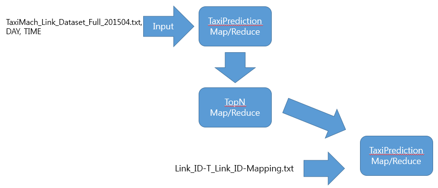

# TaxiPrediction
##서울시에서 제공하는 택시 분석 자료를 이용해 택시 수요를 예측하는 맵리듀스 프로그램

###개발환경
OS: ubuntu-14.04.1-64bit
Tool: VMware Player, Eclipse Platform(Maven Project)
Processor: single core processor
Memory: 4GB

###목표
서울시 열린데이터 광장(data.seoul.go.kr)에서 제공하는 서울시 택시 운행 분석 데이터를 이용해 특정 요일의 특정 시간대에 택시 수요가 많은 상위 10개 지역의 표준 노드 링크ID를 찾는다.

###표준 노드 링크 ID

-노드란? 차량이 도로를 주행함에 있어 속도의 변화가 발생되는 곳을 표현한 곳

-링크란? 속도변화 발생점인 노드와 노드를 연결한 선을 의미하며 실세계에서의 도로

-표준노드링크ID를 이용해 위치정보를 알아낼 수 있음
	
	관련 링크: http://nodelink.its.go.kr

###참고 문헌

직접 해보는 하둡프로그래밍/한기용 저/이지스퍼블리싱

택시운행분석 활용 가이드.pdf

###데이터셋 예시

###데이터셋 필드 설명

###데이터셋 파일 구성 정보

###처리 흐름

택시 운행 데이터가 있는 TaxiMach_Link_Dataset파일과 임의의 DAY, TIME 값을 입력하면 TaxiPredection 맵리듀스 프로그램에서 T_Link값을 키값으로 하고 승차횟수를 카운트하여 출력합니다. TaxiPrediction의 출력파일은 TopN Map클래스의 입력파일이 되고 가장 승차 횟수가 많은 상위 10개의 T_Link값을 추출합니다. 그리고 다시 TopN의 출력 파일과 Link-ID와 T_Link_ID의 매핑테이블을 갖고있는 Link_ID-T_Link_ID-Mapping파일을 MultipleInput으로 입력하여 해당하는 표존노드링크ID와 승자 빈도수를 추출합니다.

###입력 및 출력 결과

입력: hadoop jar TaxiPrediction-0.0.1-SNAPSHOT.jar TaxiPrediction /input/taxi_data/TaxiMach_Link_Dataset_Full_201504.txt /output/taxi/ 1 01 /input/taxi_data/Link_ID-T_Link_ID-Mapping.txt

Input File: /input/taxi_data/TaxiMach_Link_Dataset_Full_201504.txt
Output Path: /output/taxi/
Day: 1(일요일)
Time: 01(00시 30분 ~ 01시)
LinkResult클래스를 위한 입력파일: /input/taxi_data/Link_ID-T_Link_ID-Mapping.txt(T_Link_ID와 Link_ID 매핑테이블을 가지고 있는 파일)

일요일 00시 30분에서 01시 사이에 택시 수요가 가장많은 위치의 표준노드링크ID 값과 택시 승차 횟수
